## 第一讲：微型计算机的基本组成及各部分的功能与作用

* 数字计算机：它是一种能够存储程序，能自动连续地对各种数字化信息进行计算、逻辑运算地快速工具。在这一定义中包含两个重要的基本概念：**信息数字化，存储程序工作方式**。他们是了解计算机组成及工作机制的**基本出发点**
  
### 基本概念

1. 存储程序工作方式与冯.诺伊曼机
   1. 采用二进制代码表示数据和指令
      1. 计算机是处理信息的工具，所处理的信息称为数据。
      2. 计算机的具体的工作表现为执行程序，而程序的最终可执行形态是指令序列，即若干用数字代码表示的机器指令。
      3. 数据和指令都采用二进制代码表示，则他们在外形上并无区别都是由**0(没电)或1(有电)**组成的代码序列，只是各自约定的含义不同而已。
   
   2. 采用存储程序工作方式
      1. 事先编制程序
      2. 将程序存储于计算机的存储器之中
      3. 计算机在运行时将自动地连续地从存储器中依次取出指令加以执行

   3. 硬件系统由五大部分构成

      计算机硬件系统由运算器、存储器、控制器、输入设备、输出设备五大部件构成
      
      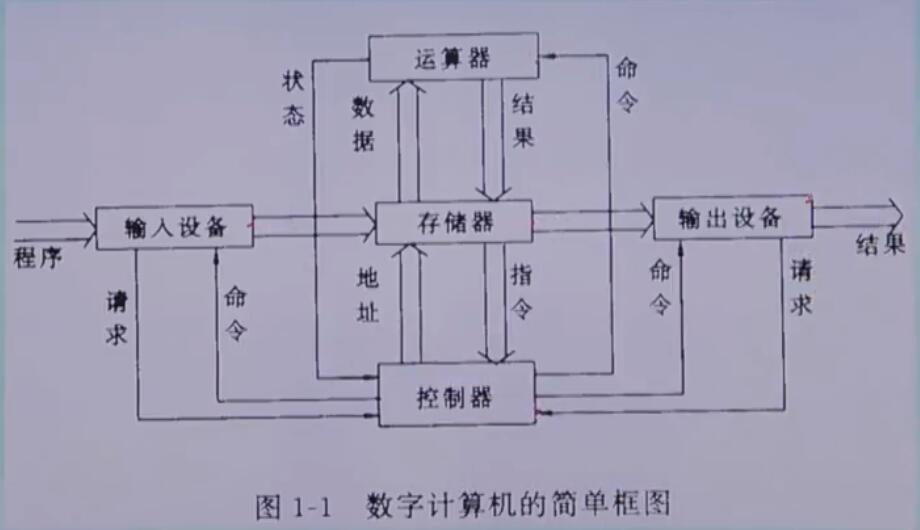
   
2. 计算机系统地软硬件组成和层次结构

   1. 硬件系统

      计算机的硬件是指系统中可接触到地物理设备实体

   2. 软件系统

      计算机软件通常泛指各类程序和文件。由于他们在计算机中的表示是一些不能直接触摸到二进制信息，所以称为软件。

### 计算机发展简史

* **第一台计算机是1946年问世的被命名为ENIAC**
* **计算机常常以器件作为划分的标准(硬件发展时代)**
  * **第一代：电子管计算机**
  * **第二代：晶体管计算机**
  * **第三代：中小规模集成电路(IC)计算机**
  * **第四代：大规模(LSI)和超大规模(VLSI)集成电路计算机**
* **软件发展时代**
  * **第一代：机器语言，每条指令用二进制编码**
  * **第二代：汇编语言，用符号编程，和具体机器指令和硬件有关**
  * **第三代：高级语言**
  * **第四代：它实际上是在高级语言的基础上集成的模块化语言，它有更强的编程功能**

---

## 第二讲：微型机的基本工作过程

---

## 第三讲：计算机中的编码、数制及其转换

* **任意进制转换成十进制**

  方法是：按权展开后相加即可

  **权：...3 2 1 0 -1 -2 -3...**

---

## 第四讲：无符号二进制数的算术运算和逻辑运算

* 布尔代数也和普通代数一样，可以写成下面的表达式

  **Y = F(A、B、C、....)**

* 但他有两个特点：

  * **A、B、C、D只有两种可能，即0或1**
    * **注意：布尔代数的变量只代表事物的两个不同的状态和性质。如“开”或“关”**
  * **函数F只有三种基本运算，即“与”、“或”、“非”
    * **注意：逻辑运算都是独立的按位进行，而和其他位的运算结果无关**

1. **“或”运算：**

   1. **逻辑表达式为：Y=A+B**
   2. **上式或运算的意义是：逻辑变量A或B中，只要有一个1，则逻辑变量Y的值为1**
   3. **全0才0，有1出1**

2. **“与”运算**

   1. **逻辑表达式为：Y = A · B**
   2. **上式与运算的意义是：逻辑变量A或B中，只有都为1，则逻辑变量Y的值为1。否则Y则为零**
   3. **全1才1，有0出0**

3. **“非”运算**

   1. **逻辑表达式**

      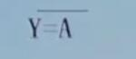

4. **摩根定理**

   1. 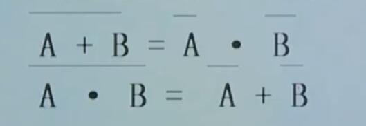
   2.   **A或B的结果的非等于A的非与B的非**
   3. **A与B的结果的非等于A的非或B的非**

5. **逻辑电路**

   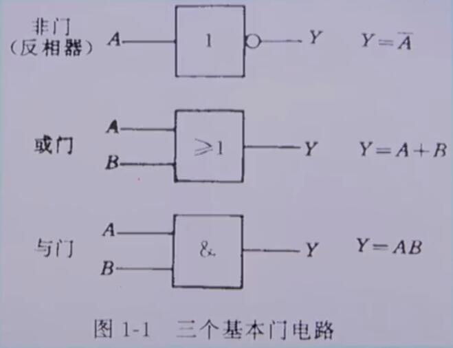

   1. **与门电路**
   2. **或门电路**
   3. **非门电路**

6. **真值表**

   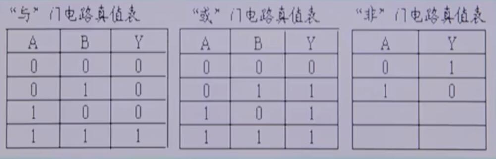

---

## 第五讲：运算中的溢出

* **溢出概念及检测方法：**

  * **在计算机中，若采用定点小数，数的表示范围为|X|<1，如果出现运算结果超出数的表示范围的现象，就称为溢出**
  * **两个正数相加，结果为负（即：大于机器所能表示的最大正数），称为上溢**
  * **两个负数相加，结果为正（即：小于机器所能表示的最大负数），称为下溢**
  * **运算出现溢出，结果就是错误的**

* **检测方法：**

  1. **双符号位法（变形补码法）**

     **用两个相同的符号位表示一个数的符号，左边第一位为第一符号位，是结果的真正符号位，相邻的为第二符号位。定义双符号位的含义为：00表示正号；11表示负号；01表示产生正向溢出；10表示负向溢出**

     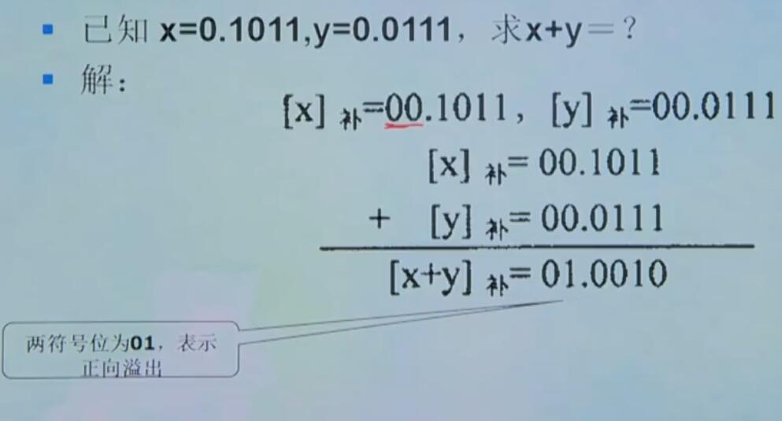

  2. **单符号位操作检测方法：**

     **当操作数中的加数与被加数符号相同时，若运算结果的符号与操作数的符号不一致，表示溢出；否则，表示没有溢出。而当加数和被加数符号不同时，相加运算的结果是绝对不会溢出的**

---

## 机器数的表示及运算

* **数据和字符的机内表示**

  * **数值数据的表示**

  * **真值与机器数：**

    * **真值：正、负符号加二进制绝对值**

      **例：-0010011B、+1011001B**

    * **机器数：在机器中使用的连同数符一起数码化的数**

      **例：10010011B、01011001B**

  * **机器数的范围：**

    * **字长为8位，无符号整数的最大值是：**

      **(11111111) B= (255) D**

      **此时机器数的范围是0~255**

    * **字长为16位，无符号整数的最大值是：**

      **(1111111111111111) B = (FFFF) H =(65535) D**

      **此时机器数的范围是0~65535**

  * **机器数的符号：**

    **在算术运算中，数据是有正有负的，将这类数据称为带符号数。**

    **为了在计算机中正确地表示带符号数，通常规定每个字节的最高位为符号位，并用0表示正数，用1表示负数。**

  * **机器数中小数点的位置：**

    **在机器中，小数点的位置通常有两种约定：**

    **一种规定小数点的位置固定不变，这时的机器数称为“定点数”**
    
    **另一种规定小数点的位置可以浮动，这时的机器数称为“浮点数”**
  
* **数值数据在机内的表示**

  * **定点小数**

    **定点小数 是纯小数，是将小数点固定在符号d0之后，数值最高位d1之前，这就是定点小数形式**

    **其格式如下所示：**

    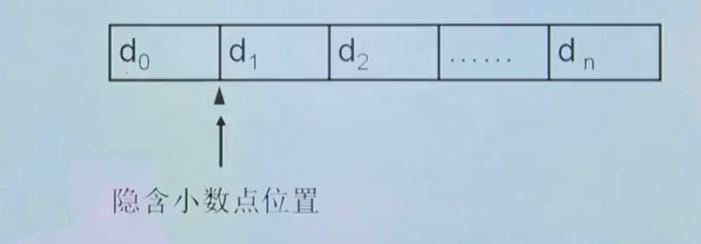

  * **定点整数**

    **定点整数是纯整数，是将小数点固定在数的最低位之后，这就是定点整数形式**

    **其格式如下所示：**

    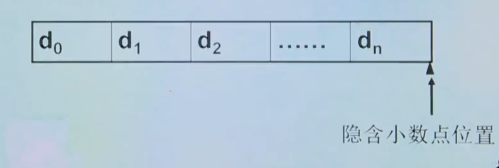

  * **浮点表示法**

    **浮点表示法与数学中的科学计数法相似，是指计算机中的小数点位置不是固定的，或者说是“浮动”的。对于任何一个二进制数N都可以表示为：**

    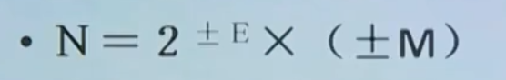

    **式中，M称为N的尾数，是一个纯小数，E是数N阶码，是一个整数**

    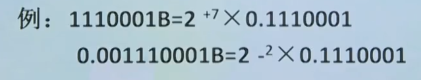

  * **计算机中机器浮点数由以下部分组成：**

    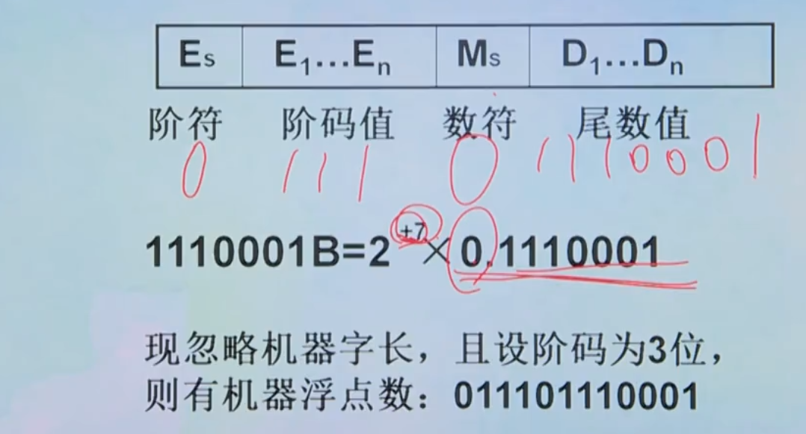

  * **浮点数的规格化**

    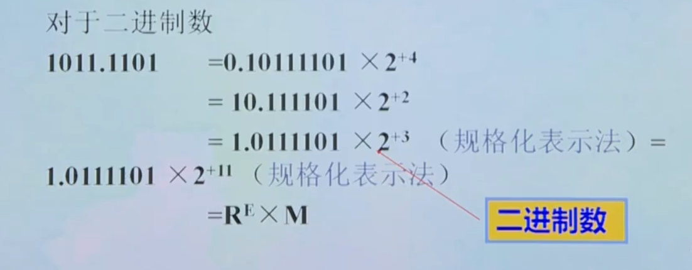

* **数的机器码表示——有符号数的表示方法**

  **数有正、负之分，在计算机中，采用数的符号和数值一起编码的方法来表示数据**

  **常用的表示法有：原码表示法、反码表示法、补码表示法和移码表示法**

  * **原码**

    **正数的符号位为0，负数的符号位为1，其他位按照一般的方法来表示数的绝对值。用这样的表示方法得到的就是数的原码**

    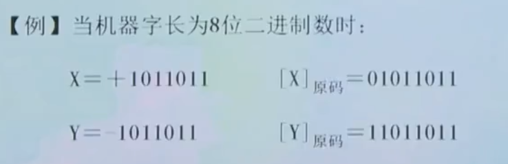

    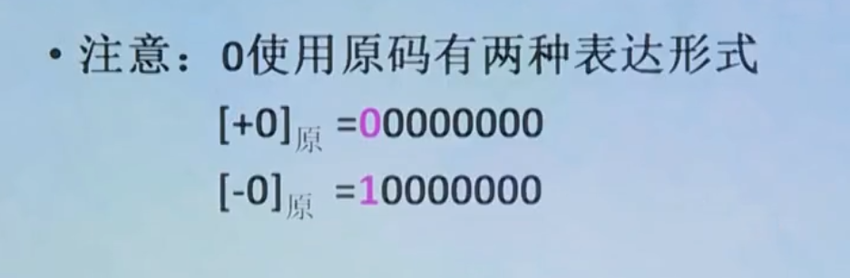

  * **反码**

    **对于一个带符号的数来说，正数的反码与其原码相同，负数的反码为其原码除符号位以外的各位按位取反**

    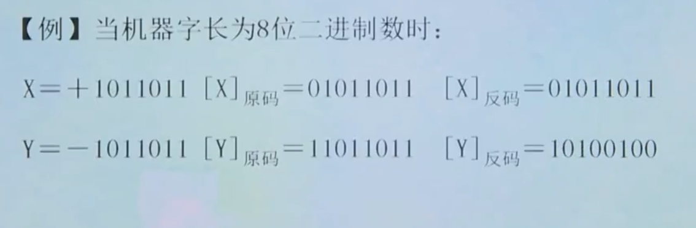

  * **补码**

    **正数的补码与其原码相同，负数的补码为其反码在最低位加1**

    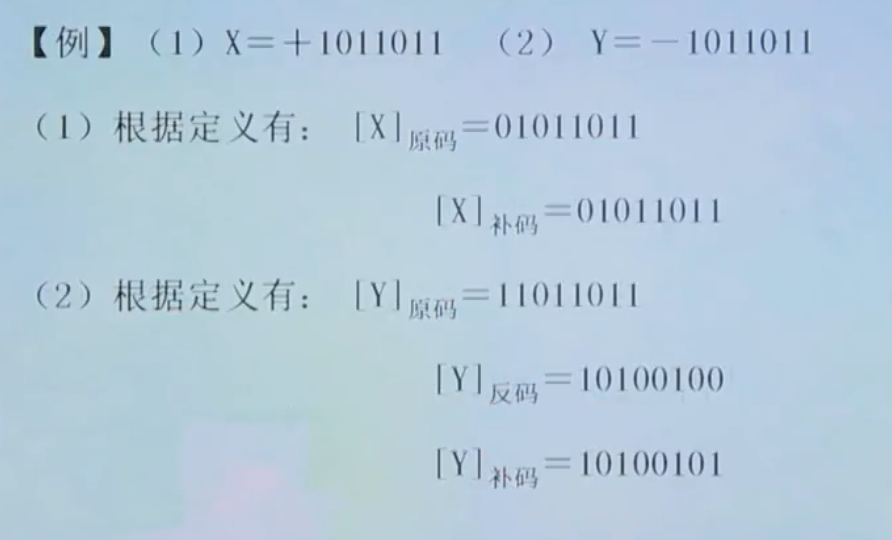

  * **移码**

    **移码也叫增码，它常以整数形式用在计算机浮点数的阶码（表示指数）中。若纯整数X为n位（包括符号位），则其移码定义为：**

    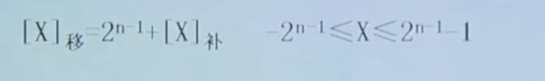

    **求移码的方法：**

    * **根据定义**

    * **将该数补码的符号位求反即得该数的移码**

      **即：移码与补码的形式相同，只是符号位相反**

  * **BCD码**

    **BCD码又称为“二——十进制编码”，专门解决用二进制表示十进制的问题。最常用的是8421编码，其方法是用4位二进制表示1位十进制，自左至右每一位对应的位权是8、4、2、1，如果按位权展开求和，和数就等于该数码所对应的十进制数。**

    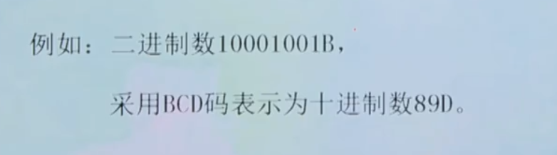

* **非数值数据在机内的表示**

  * **字符的编码**

    * **ASCLL码**

      **一般采用美国标准信息交换码，它使用七位二进制编码来表示符号，通常把它称为ASCLL码。由于使用七位码来表示一个符号，故该编码方案中共有128个符号**

      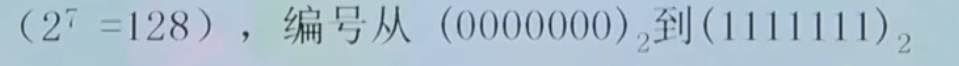

      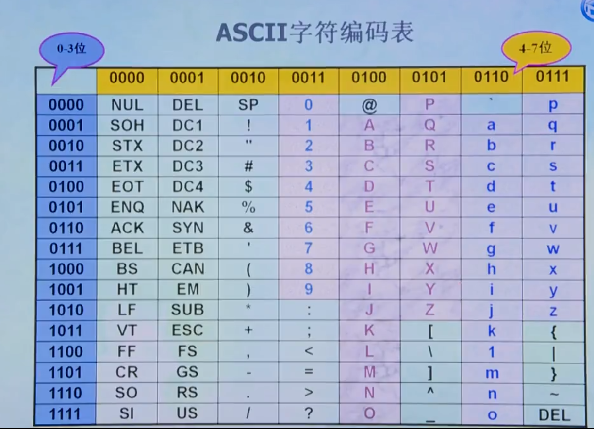
  
* **定点加法、减法运算**

  * **补码运算的优点：可将减法运算转化为加法运算，从而简化机器内部硬件电路的结构**
  * **补码运算的特点：符号位和数值一起参加运算，只要结果不发生溢出，得到的就是本次运算的结果**

---

## 基本逻辑门及常用逻辑部件

* **其他的门电路**

  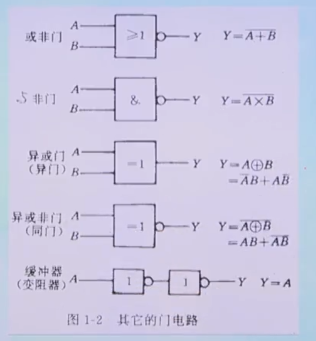

  **其中缓冲器的作用是改变输出电阻，以提高带负载能力**

* **真值表**

  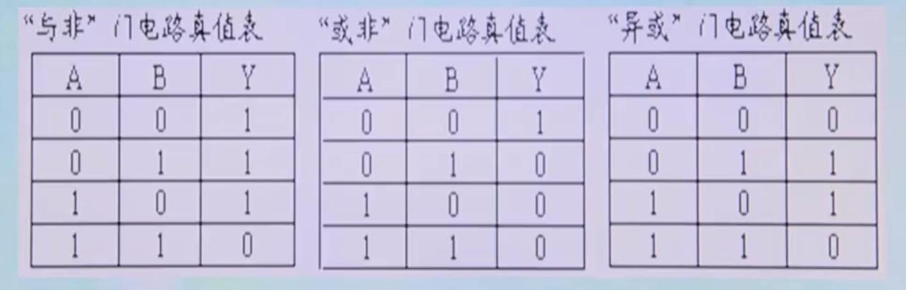

* **半加器与全加器**

  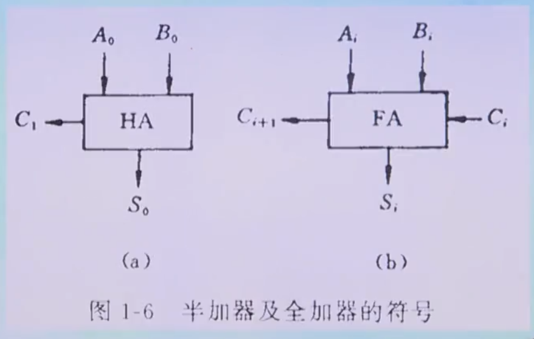