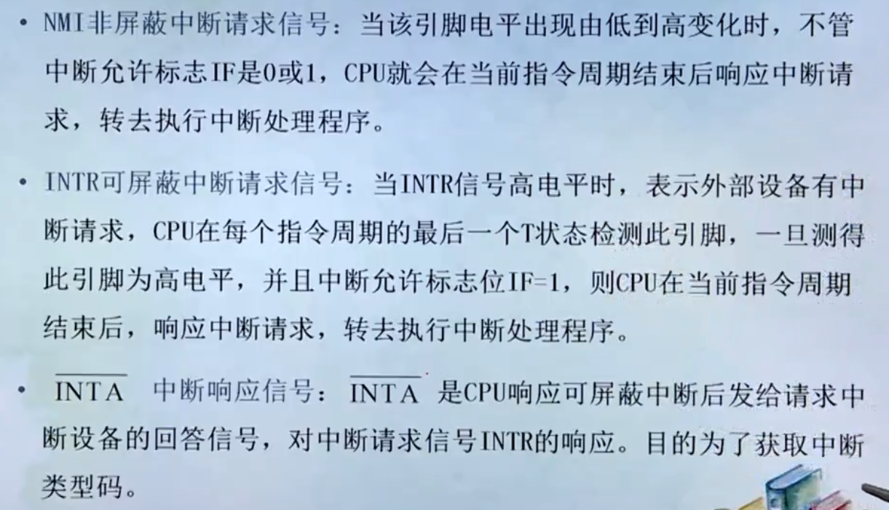

## su第一讲：微型计算机的基本组成及各部分的功能与作用

* 数字计算机：它是一种能够存储程序，能自动连续地对各种数字化信息进行计算、逻辑运算地快速工具。在这一定义中包含两个重要的基本概念：**信息数字化，存储程序工作方式**。他们是了解计算机组成及工作机制的**基本出发点**
  
### 基本概念

1. 存储程序工作方式与冯.诺伊曼机
   1. 采用二进制代码表示数据和指令
      1. 计算机是处理信息的工具，所处理的信息称为数据。
      2. 计算机的具体的工作表现为执行程序，而程序的最终可执行形态是指令序列，即若干用数字代码表示的机器指令。
      3. 数据和指令都采用二进制代码表示，则他们在外形上并无区别都是由**0(没电)或1(有电)**组成的代码序列，只是各自约定的含义不同而已。
   
   2. 采用存储程序工作方式
      1. 事先编制程序su
      2. 将程序存储于计算机的存储器之中
      3. 计算机在运行时将自动地连续地从存储器中依次取出指令加以执行

   3. 硬件系统由五大部分构成

      计算机硬件系统由运算器、存储器、控制器、输入设备、输出设备五大部件构成
      
      
   
2. 计算机系统地软硬件组成和层次结构

   1. 硬件系统

      计算机的硬件是指系统中可接触到地物理设备实体

   2. 软件系统

      计算机软件通常泛指各类程序和文件。由于他们在计算机中的表示是一些不能直接触摸到二进制信息，所以称为软件。

### 计算机发展简史

* **第一台计算机是1946年问世的被命名为ENIAC**
* **计算机常常以器件作为划分的标准(硬件发展时代)**
  * **第一代：电子管计算机**
  * **第二代：晶体管计算机**
  * **第三代：中小规模集成电路(IC)计算机**
  * **第四代：大规模(LSI)和超大规模(VLSI)集成电路计算机**
* **软件发展时代**
  * **第一代：机器语言，每条指令用二进制编码**
  * **第二代：汇编语言，用符号编程，和具体机器指令和硬件有关**
  * **第三代：高级语言**
  * **第四代：它实际上是在高级语言的基础上集成的模块化语言，它有更强的编程功能**

---

## 第二讲：微型机的基本工作过程

---

## 第三讲：计算机中的编码、数制及其转换

* **任意进制转换成十进制**

  方法是：按权展开后相加即可

  **权：...3 2 1 0 -1 -2 -3...**

---

## 第四讲：无符号二进制数的算术运算和逻辑运算

* 布尔代数也和普通代数一样，可以写成下面的表达式

  **Y = F(A、B、C、....)**

* 但他有两个特点：

  * **A、B、C、D只有两种可能，即0或1**
    * **注意：布尔代数的变量只代表事物的两个不同的状态和性质。如“开”或“关”**
  * **函数F只有三种基本运算，即“与”、“或”、“非”
    * **注意：逻辑运算都是独立的按位进行，而和其他位的运算结果无关**

1. **“或”运算：**

   1. **逻辑表达式为：Y=A+B**
   2. **上式或运算的意义是：逻辑变量A或B中，只要有一个1，则逻辑变量Y的值为1**
   3. **全0才0，有1出1**

2. **“与”运算**

   1. **逻辑表达式为：Y = A · B**
   2. **上式与运算的意义是：逻辑变量A或B中，只有都为1，则逻辑变量Y的值为1。否则Y则为零**
   3. **全1才1，有0出0**

3. **“非”运算**

   1. **逻辑表达式**

      

4. **摩根定理**

   1. 
   2.   **A或B的结果的非等于A的非与B的非**
   3. **A与B的结果的非等于A的非或B的非**

5. **逻辑电路**

   

   1. **与门电路**
   2. **或门电路**
   3. **非门电路**

6. **真值表**

   

---

## 第五讲：运算中的溢出

* **溢出概念及检测方法：**

  * **在计算机中，若采用定点小数，数的表示范围为|X|<1，如果出现运算结果超出数的表示范围的现象，就称为溢出**
  * **两个正数相加，结果为负（即：大于机器所能表示的最大正数），称为上溢**
  * **两个负数相加，结果为正（即：小于机器所能表示的最大负数），称为下溢**
  * **运算出现溢出，结果就是错误的**

* **检测方法：**

  1. **双符号位法（变形补码法）**

     **用两个相同的符号位表示一个数的符号，左边第一位为第一符号位，是结果的真正符号位，相邻的为第二符号位。定义双符号位的含义为：00表示正号；11表示负号；01表示产生正向溢出；10表示负向溢出**

     

  2. **单符号位操作检测方法：**

     **当操作数中的加数与被加数符号相同时，若运算结果的符号与操作数的符号不一致，表示溢出；否则，表示没有溢出。而当加数和被加数符号不同时，相加运算的结果是绝对不会溢出的**

---

## 机器数的表示及运算

* **数据和字符的机内表示**

  * **数值数据的表示**

  * **真值与机器数：**

    * **真值：正、负符号加二进制绝对值**

      **例：-0010011B、+1011001B**

    * **机器数：在机器中使用的连同数符一起数码化的数**

      **例：10010011B、01011001B**

  * **机器数的范围：**

    * **字长为8位，无符号整数的最大值是：**

      **(11111111) B= (255) D**

      **此时机器数的范围是0~255**

    * **字长为16位，无符号整数的最大值是：**

      **(1111111111111111) B = (FFFF) H =(65535) D**

      **此时机器数的范围是0~65535**

  * **机器数的符号：**

    **在算术运算中，数据是有正有负的，将这类数据称为带符号数。**

    **为了在计算机中正确地表示带符号数，通常规定每个字节的最高位为符号位，并用0表示正数，用1表示负数。**

  * **机器数中小数点的位置：**

    **在机器中，小数点的位置通常有两种约定：**

    **一种规定小数点的位置固定不变，这时的机器数称为“定点数”**
    
    **另一种规定小数点的位置可以浮动，这时的机器数称为“浮点数”**
  
* **数值数据在机内的表示**

  * **定点小数**

    **定点小数 是纯小数，是将小数点固定在符号d0之后，数值最高位d1之前，这就是定点小数形式**

    **其格式如下所示：**

    

  * **定点整数**

    **定点整数是纯整数，是将小数点固定在数的最低位之后，这就是定点整数形式**

    **其格式如下所示：**

    

  * **浮点表示法**

    **浮点表示法与数学中的科学计数法相似，是指计算机中的小数点位置不是固定的，或者说是“浮动”的。对于任何一个二进制数N都可以表示为：**

    

    **式中，M称为N的尾数，是一个纯小数，E是数N阶码，是一个整数**

    

  * **计算机中机器浮点数由以下部分组成：**

    

  * **浮点数的规格化**

    

* **数的机器码表示——有符号数的表示方法**

  **数有正、负之分，在计算机中，采用数的符号和数值一起编码的方法来表示数据**

  **常用的表示法有：原码表示法、反码表示法、补码表示法和移码表示法**

  * **原码**

    **正数的符号位为0，负数的符号位为1，其他位按照一般的方法来表示数的绝对值。用这样的表示方法得到的就是数的原码**

    

    

  * **反码**

    **对于一个带符号的数来说，正数的反码与其原码相同，负数的反码为其原码除符号位以外的各位按位取反**

    

  * **补码**

    **正数的补码与其原码相同，负数的补码为其反码在最低位加1**

    

  * **移码**

    **移码也叫增码，它常以整数形式用在计算机浮点数的阶码（表示指数）中。若纯整数X为n位（包括符号位），则其移码定义为：**

    

    **求移码的方法：**

    * **根据定义**

    * **将该数补码的符号位求反即得该数的移码**

      **即：移码与补码的形式相同，只是符号位相反**

  * **BCD码**

    **BCD码又称为“二——十进制编码”，专门解决用二进制表示十进制的问题。最常用的是8421编码，其方法是用4位二进制表示1位十进制，自左至右每一位对应的位权是8、4、2、1，如果按位权展开求和，和数就等于该数码所对应的十进制数。**

    

* **非数值数据在机内的表示**

  * **字符的编码**

    * **ASCLL码**

      **一般采用美国标准信息交换码，它使用七位二进制编码来表示符号，通常把它称为ASCLL码。由于使用七位码来表示一个符号，故该编码方案中共有128个符号**

      

      
  
* **定点加法、减法运算**

  * **补码运算的优点：可将减法运算转化为加法运算，从而简化机器内部硬件电路的结构**
  * **补码运算的特点：符号位和数值一起参加运算，只要结果不发生溢出，得到的就是本次运算的结果**

---

## 基本逻辑门及常用逻辑部件

* **其他的门电路**

  

  **其中缓冲器的作用是改变输出电阻，以提高带负载能力**

* **真值表**

  

* **半加器与全加器**

  

---

## 8086/8088CPU的内部结构和外部引线

1. **CPU的功能和结构**

   **当代主流计算机所遵循的仍然是冯·诺伊曼的“存储程序、程序控制”思想**

   **程序告诉计算机：应该逐步执行什么操作；在什么地方找到用来操作的数据，结果存到何处等**

2. **CPU的功能**

   1. **指令控制**

      **保证机器按程序规定的顺序取出执行**

   2. **操作控制**

      **CPU产生每条指令所对应的操作信号，并把各种操作信号送往相应的部件，从而控制这些部件按指令的要求进行动作**

   3. **时间控制**

      **对各种操作的实施时间进行定时**

   4. **数据加工**

      **对数据进行算术运算和逻辑运算处理**

3. **CPU的基本组成**

   * **以前的CPU主要由运算器和控制器两大部分组成，随着集成电路的发展，目前CPU芯片上集成了一些其他逻辑功能的部件来扩充CPU的功能，比如Cache等**

   * **Cache（高速缓存存储器），是为了解决CPU和主存储器之间速度匹配的问题而设置的**

   * **运算器是数据加工处理软件，所进行的全部操作由控制器发出的控制信号指挥**

     1. **执行所有的算术运算**
     2. **执行所有的逻辑运算，并进行逻辑测试**

   * **控制器完成对整个计算机系统操作的协调与指挥**

     1. **控制机器从内存中取出一条指令，并指出下一条指令在内存中的位置**
     2. **对指令进行译码，并产生相应的操作控制信号，送往相应的部件，启动规定的动作**
     3. **指挥并控制CPU、内存与输入/输出（I/O）设备之间数据的流动方向**

   * **CPU的基本模型**

     

     * **数据缓存寄存器（DR）：暂时存放由内存读出或写入的指令或数据字**
     * **指令寄存器（IR）：保存当前正在执行的一条指令**
     * **程序计数器（PC）：确定下一条指令的地址**
     * **地址寄存器（AR）：保存当前CPU所访问的内存单元的地址**
     * **累加寄存器（AC）：最常使用的一个通用寄存器**
     * **状态条件寄存器（PSW）：保存由算术和逻辑指令的结果建立的各种条件码**

4. **8086CPU最小模式下的引脚信号及功能**

   

   * **数据地址引脚**

     1. **地址、数据引脚线**

     * **AD0~AD15（Address/Data Bus）**
     * **分时复用的地址数据引脚线，具有双向、三态功能**
     * **在总线周期T1期间作地址线A0~A15用，此时输出存储单元的低16位地址**
     * **在T2~T3期间作数据线D0~D15用，是双向的。当CPU响应中断时，以及系统总线处理“保持相应”状态时，AD0~AD15都处于悬空状态**
     * **A19/S6~A16/S3**
     * **地址/状态分时复用，输出引脚**
     * **在T1期间，作地址线A19~A16，对存储单元进行读写时，高四位地址由A16~A19输出；就和A0~A15组合在一起构成20位地址总线A0~A19**
     * **在T2~T4期间作为S3~S6状态线用**
     * **S6状态为低电平表明8086/8088CPU正与总线相连**
     * **S5状态表示当前中断状态允许标志IF的状态，如果IF=1表明当前允许可屏蔽中断请求，IF=0表明当前禁止可屏蔽中断请求**
     * **S4和S3状态组合起来指出CPU正在使用哪一个段寄存器**

     2. **读写控制引脚**

     * **ALE（Address Latch Enable）**
     * **地址锁存允许，输出、三态**
     * **ALE引脚高电平有效**
     * **当复用引脚AD0~AD15和A16/S3~A19/S6正在传送地址信息，CPU提供ALE有效电平，将地址信息锁存到地址锁存器中**
     * **IO/M（Input and Output/Memory）**
     * **该引脚输出高电平时，表示CPU将访问I/O端口，这时地址总线A0~A15提供16位I/O口地址**
     * **该引脚输出低电平时，表示CPU将访问存储器，这时地址总线A0~A19提供20位存储器地址**
     * **WR （Write）**
     * **写控制，输出、三态、低电平有效**
     * **有效时，表示CPU正在写出数据给存储器或I/O端口**
     * **RD（Read）**
     * **读控制，输出、三态、低电平有效**
     * **有效时，表示CPU正在从存储器或I/O端口读入数据**
     * **READY（ready）准备就绪信号：存储器和I/O就绪**
     * **使CPU和低速的存储器或I/O设备之间实现速度匹配的信号**
     * **当READY为高电平时，表示内存或I/O设备已准备就绪，可以立即进行一次数据传输**
     * **CPU在每个总线周期的T3状态对READY引脚进行检测，若检测到READY=1,则总线周期按正常时序进行读、写操作；不需要插入等待状态Tw。若测得READY=0，则表示存储器或I/O设备工作速度慢，没有准备好数据，则CPU在T3和T4之间自动插入一个或几个等待状态Tw来延长总线周期，直叨检测到READY为高电平后，才使CPU退出等待进入T4状态，完成数据传送。**
     * **DEN（Data Enable）**
     * **数据允许信号，输出、三态、低电平有效**
     * **有效时，表示当前数据总线上正在传送数据**
     * **DT/R（Data Transmit Receive）**
     * **数据发送/接受，控制数据传送的方向**
     * **该信号表明当前总线上数据的流向**
       * **高电平时数据自CPU输出（发送）**
       * **低电平时数据输入CPU（接受）**

     3. **总线请求和响应信号**

     * **HOLD（Hold Request）总线保持请求信号**
     * **HLDA（Hold Acknowledge）总线保持响应信号**
     * **HOLD总线保持请求信号：**
     * **最小模式系统中，除CPU（8086/8088）以外的其它总线控制器，如DMA控制器申请使用系统总线的请求信号**

     4. **中断请求和响应信号**

     * **中断请求和响应操作有两种类型的中断:**
     * **非屏蔽中断和可屏蔽中断**

     

     

     5. **其他引脚**

     * **RESET**
     * **复位请求，输入、高电平有效**
     * **该信号有效，将使CPU回到其初始状态**
     * **在复位状态，CPU内部的寄存器初始化**
     * **CLK（Clock）**
     * **时钟输入**
     * **系统通过该引脚给CPU和总线控制提供内部定时脉冲**
     * **8086/8088CPU的时钟一般都是由时钟发生器Intel 8284A芯片来产生的**
     * **Vcc**
     * **电源输入，向CPU提供+5V电源**
     * **GND**
     * **接地，向CPU提供参考地电平**
     * **MN/MX**
     * **组态选择，输入**
     * **接高电平时，8086引脚工作在最小组态；反之，8086工作在最大组态**
     * **TEST**
     * **测试，输入、低电平有效**
     * **TEST信号和WAIT指令配合使用，当CPU执行WAIT指令时，CPU处于等待状态，一旦检测到TEST信号为低，则结束等待状态，继续执行WAIT指令下面的指令**

   * **引脚小结**

     * **CPU引脚是系统总线的基本信号**
     * **可以分成三类信号**
     * **16位数据线：D0~D15**
     * **20位地址线：A0~A19**
     * **控制线：**
       * **ALE、IO/M、WR、RD、READY**
       * **INTR、INTA、NMI、HOLD、HLDA**
       * **RESET、CLK、Vcc、GND**
   
5. **分时复用**

   * **分时复用就是一个引脚在不同的时刻具有两个甚至多个作用**
   * **最常见的总线复用是数据和地址引脚复用**
   * **总线复用的目的是为了减少对外引脚个数**
   * **8088/8086CPU 的数据地址线采用了总线复用方法**

---

## 8086、8088CPU的工作模式

* **8086/8088的工作模式完全是由硬件决定的**
* **为了尽可能适应各种使用场合，在设计8086/8088CPU芯片时，就使得他们可以在这两种工作模式下工作，即最大模式和最小模式**

#### 最小模式

**就是在系统中只有8086/8088一个微处理器。在这种系统中，所有的总线控制信号都直接由8086/8088产生，因此，系统中的总线控制逻辑电路被减到最小**

#### 最大模式

**最大模式是相对最小模式而言，它用在中等规模的或者大型的8086/8088系统中，在此系统中，包括两个或多个微处理器，其中一个主处理器就是8086/8088，其他的处理器称为协处理器。他们是协调主处理器工作的。和8086/8088配合的协处理器有两个，一个是数值运算协处理器8087，一个是输入/输出协处理器8089**

* **8087**

  **8087是一种专用于数值运算的处理器，它能实现多种类型的数值操作，例如高精度的整数和浮点运算，也可以进行超越函数（如：三角函数、对数函数）的计算**

**在最大模式下，一般包括2个或多个处理器，这样就能解决主处理器和协处理器之间的协调工作问题和对总线的共享控制问题在最大模式下，CPU不直接产生总线控制信号，而是将总线开始的状态信息等信号经一个控制信号转移电路，即8288总线控制器**

**另外，在最大模式下，一般还有中断优先控件，即8289A，在8086多处理器系统中，除8086CPU外还有8089和8087，他们也是采用分时方式来占用总线。因此，在多处理器系统中必须采用总线仲裁器8289配合总线控制器8288来确定每一个时刻的总线使用权赋予优先级别较高的的处理器使用**

---

## 总线BUS概念

#### 总线定义

**微机中各模块、各设备间传输信息的一组公用信号线**

#### 总线标准

**在总线连接和传输信息时应该遵循的协议和规范。包括：时钟、结构、电气、机械、协议、仲裁规范等**

#### 三大总线

* **地址线**
* **数据线**
* **控制线**

---

## 8086、8088的存储器结构

### 1.8086/8088CPU的寄存器

